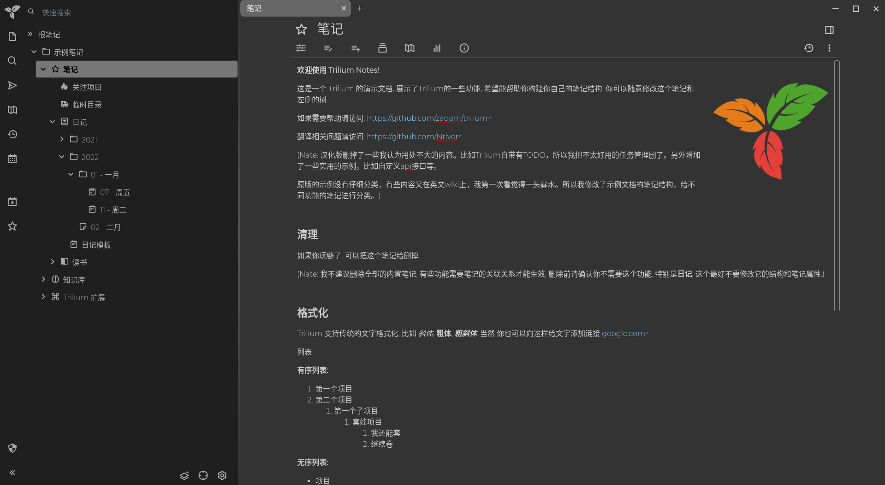
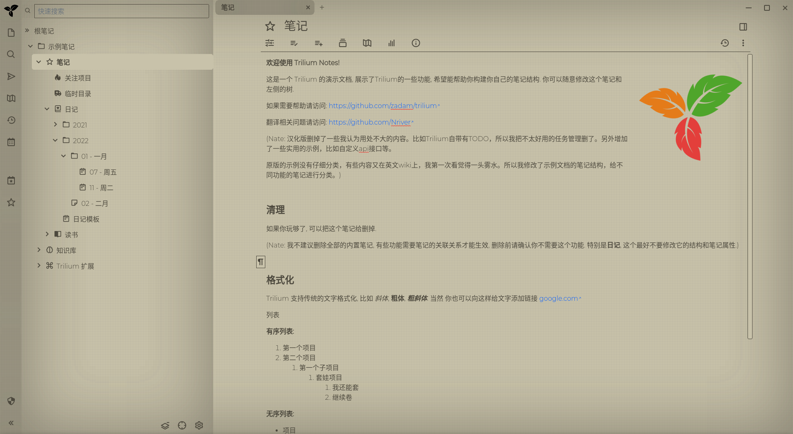
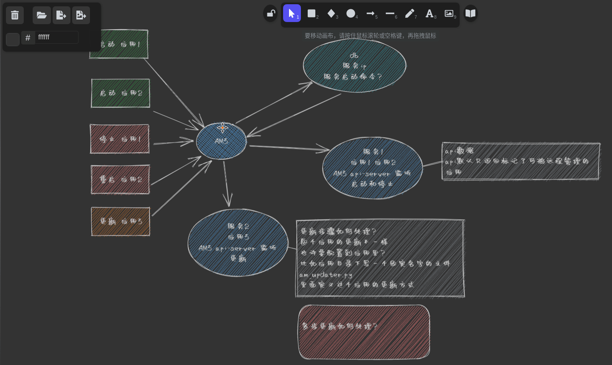
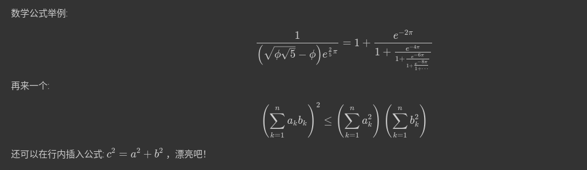

# 🌏 Trilium Translation

[](https://GitHub.com/nriver/trilium-translation/releases/)
[](https://github.com/nriver/trilium-translation/blob/master/LICENSE)
[](https://GitHub.com/nriver/trilium-translation/graphs/commit-activity)
[](https://github.com/nriver/trilium-translation/releases/)
[](https://hub.docker.com/repository/docker/nriver/trilium-cn/general)

<p align="center">
English | <a href="README_CN.md">简体中文</a>
</p>

This repo provides a translation for the awesome [Trilium Notes](https://github.com/zadam/trilium).
If you'd like to translate Trilium Notes into any language you like, please
follow [this guide](https://github.com/Nriver/trilium-translation#how-to-translate).
Currently, I have translated Trilium Notes into Chinese. The translation will keep update to the latest Trilium Notes'
stable releases.

Star this repo if you like it, thx :)

If you have old data, PLEASE BACK UP YOUR DATA BEFORE USE.

# 🦮 Table of Contents

<!--ts-->

* [🌏 Trilium Translation](#-trilium-translation)
* [🦮 Table of Contents](#-table-of-contents)
* [📸 Screenshots](#-screenshots)
* [📚 How to use](#-how-to-use)
* [🐳 How to run server with docker](#-how-to-run-server-with-docker)
* [🌐 How to translate](#-how-to-translate)
    * [🌐 How does the translation work](#-how-does-the-translation-work)
        * [💻 Compile Environment Requirement](#-compile-environment-requirement)
        * [🔍 Translate Process](#-translate-process)
        * [📝 More text to translate](#-more-text-to-translate)
* [🛑 Limitations](#-limitations)
* [🤔 Common questions](#-common-questions)
    * [Which VPS provider are you using to run the Trilium Notes server?](#which-vps-provider-are-you-using-to-run-the-trilium-notes-server)
    * [Some Questions Regarding Domain Names](#some-questions-regarding-domain-names)
        * [How to Enable HTTPS Encryption?](#how-to-enable-https-encryption)
        * [Where Did You Purchase Your Domain?](#where-did-you-purchase-your-domain)
        * [How to Apply for a Website Certificate?](#how-to-apply-for-a-website-certificate)
    * [Why my translation is not working?](#why-my-translation-is-not-working)
    * [Where is the Note Database?](#where-is-the-note-database)
        * [Default Paths for Client Databases](#default-paths-for-client-databases)
        * [Default Path for Server Database](#default-path-for-server-database)
    * [How to Change the Database Location?](#how-to-change-the-database-location)
* [⏳ Stargazers over time](#-stargazers-over-time)
* [💰 Donation](#-donation)
* [🙏 Thanks](#-thanks)

<!--te-->

---

# 📸 Screenshots

Original dark theme



Original light theme


Nier theme made by me :)



Canvas Note



Math formular



---

# 📚 How to use

1. Download from the latest [Release](https://github.com/Nriver/trilium-translation/releases) that suit your computer
   system.
2. Unzip and execute(trilium for Linux, trilium.sh for Linux server, trilium.exe for Windows, trilium.app for macOS).
3. Enjoy :)

# 🐳 How to run server with docker

For Trilium Notes server, you can download
my [docker-compose.yml](https://github.com/Nriver/trilium-translation/blob/main/docker-compose.yml)
Then run it with docker simply by executing:

```
docker-compose up -d
```

It will download the Chinese version of Trilium I built
on [Docker Hub](https://hub.docker.com/repository/docker/nriver/trilium-cn).

Open http://127.0.0.1:8080 in your browser to access the server page.

Your note data will be in the same directory of the docker-compose.yml file.

---

# 🌐 How to translate

If you would like to check the code (my codes comes with Chinese and English comments, check it) and compile it by
yourself. Here is some information may be useful.

WARNING! The scripts I wrote includes some 'rm -rf' commands, modify and use codes with care!

## 🌐 How does the translation work

It extracts the resource files from the latest Trilium Notes official release and use regular expression to replace UI
text for each file. Then pack the translated files back into the package. Done.

### 💻 Compile Environment Requirement

My environment is Manjaro(Linux) based, but you can make some change to work on other platform. You need to change
some path configuration in my code to work on your machine.

Python3 with module

```
pip3 install requests --user
```

Nodejs with module

```
npm install -g asar webpack webpack-cli
npm install webpack --save-dev
```

7z if you want to make release

### 🔍 Translate Process

1. Modify configurations in `settings.py` by the comments.
2. Do translate in `translations.py`. (See `translations_cn.py`. There are over 1000 lines to translate, be patient :) )
3. Run `python3 init.py` to download latest Trilium Notes.
4. Run `python3 trans.py` to make a translation patch.
4. Run `python3 make_release.py` to apply patch to releases for all platforms.

Note: In `translations.py` there are some texts begin or ends with quotes were made on purpose for regex match, do not
remove them in your translation. There are some text like '${xxxx}' in the translation, these are the placeholder in the
original Trilium Notes source code, do not modify them unless you know what you are doing.

### 📝 More text to translate

If you'd like to translate more text, mark each text in the file that you want to translate with double brackets`{{}}`
like I did in `trans.py`.

Put everything between double brackets into the dict in `translations.py` and translate to the language you like. (Some
text were ended with `}`. Try to avoid triple brackets by change from `${xxx}}}'` to something like `${xxx}'}}` )

---

# 🛑 Limitations

The translation is hard-coded in the frontend/backend source code, so you can not switch between languages.
If there were some mistakes in the translation, Trilium Notes may not function correctly. Therefore, please back up your
data before use.

If you break Trilium Notes somehow, you need to redownload everything with `init.py`.

---

# 🤔 Common questions

The following are some representative questions that I feel are frequently asked by users, so I'll summarize them.

## Which VPS provider are you using to run the Trilium Notes server?

I'm using Racknerd now. It's insainly cheap. And very suitable to host Trilium Server.

Racknerd's promotions seem to be ongoing, and you can always purchase them. If you're interested, you might want to give
it a try. The links include an affiliate code, which you can remove if you prefer.

I've tested Trilium's server program, and it typically consumes around 150MB of memory. So, the cheapest level would be
sufficient, which costs only $10 per year. If you find the storage is not enough for you, you can try the slightly more
expensive option, which is usually less than $20 per year and can provide you with about 30GB of SSD storage.

| Promotion             | RAM  | CPU    | SSD | Bandwidth  | Price       | Purchase                                                 |
|-----------------------|------|--------|-----|------------|-------------|----------------------------------------------------------|
| 2024 Dragon Boat Festival | 1.25G | 1 Core | 20G | 2TB/month | $12.88/year | [Link](https://my.racknerd.com/aff.php?aff=6217&pid=850) |
| 2024 Dragon Boat Festival | 2G    | 2 Cores | 30G | 4TB/month | $19.88/year | [Link](https://my.racknerd.com/aff.php?aff=6217&pid=851) |
| 2024 Chinese New Year | 1G   | 1 Core | 15G | 2T/Month   | $10.99/Year | [Link](https://my.racknerd.com/aff.php?aff=6217&pid=838) |
| 2024 Chinese New Year | 1.5G | 1 Core | 25G | 4T/Month   | $16.88/Year | [Link](https://my.racknerd.com/aff.php?aff=6217&pid=839) |
| 2024 New Year         | 768M | 1 Core | 21G | 1T/Month   | $11.49/Year | [Link](https://my.racknerd.com/aff.php?aff=6217&pid=826) |
| 2024 New Year         | 2G   | 1 Core | 35G | 2.5T/Month | $17.38/Year | [Link](https://my.racknerd.com/aff.php?aff=6217&pid=827) |
| 2023 Black Friday     | 768M | 1 Core | 15G | 1T/Month   | $10.18/Year | [Link](https://my.racknerd.com/aff.php?aff=6217&pid=792) |
| 2023 Black Friday     | 2G   | 1 Core | 30G | 2.5T/Month | $16.98/Year | [Link](https://my.racknerd.com/aff.php?aff=6217&pid=793) |

You can also choose other VPS providers, but remember to back up your data. Data is priceless. Make sure to perform
backups just in case, and keep it in mind.

## Some Questions Regarding Domain Names

### How to Enable HTTPS Encryption?

In general, HTTP requests accessed through ports are plaintext. If you need to use HTTPS encryption, it must be used in
conjunction with the domain.

### Where Did You Purchase Your Domain?

I purchased my domain from Namesilo, and the prices are quite reasonable. Feel free to give it a try if you're
interested. Below is the link with an affiliate tag; you can remove it if you prefer. Additionally, there is a coupon
code `nriver` that can save you $1 on your first domain purchase.

[Domain Purchase Link](https://www.namesilo.com/?rid=d62cb16lq)

### How to Apply for a Website Certificate?

As for website certificates, you can use the free `acme.sh` tool. For specific instructions, you can refer to
the [acme.sh documentation on certificate issuance](https://github.com/acmesh-official/acme.sh/wiki/%E8%AF%B4%E6%98%8E).

## Why my translation is not working?

If you have run the original version of the Trilium program and there is a cache of the English version in your system,
please follow these steps:

1. Close Trilium.
2. On Windows, delete the directory `C:\Users\Username\AppData\Roaming\Trilium Notes`.
3. On Linux, delete the directory `~/.config/Trilium Notes/`.
4. Restart Trilium, and it will be in your translated language.

## Where is the Note Database?

### Default Paths for Client Databases

- Windows: C:\Users\Username\AppData\Roaming\trilium-data
- Linux: /home/Username/.local/share/trilium-data
- Mac: /Users/Username/Library/ApplicationSupport/trilium-data

### Default Path for Server Database

- Linux Server: /home/Username/trilium-data
- Docker: In the `trilium-data` folder in the same directory as docker-compose.yml

## How to Change the Database Location?

You can refer to the client's built-in `trilium-portable.sh` or `trilium-portable.bat` to run it in a portable manner.
To change the database location, simply modify the database path in the file.

If you want to experience the latest original features, it is recommended to use this method.

---

# ⏳ Stargazers over time

Generated by [caarlos0/starcharts](https://github.com/caarlos0/starcharts).

[](https://starchart.cc/Nriver/trilium-translation)

---

# 💰 Donation

Hello! If you appreciate my creations, kindly consider backing me. Your support is greatly appreciated. Thank you!

Alipay:  


Wechat Pay:  


Ko-fi:  
[](https://ko-fi.com/nriver)

---

# 🙏 Thanks

Thanks `t**e` for donating 20 CNY!

Thanks `1*0` for donating 8 CNY! Memo: 蜜雪冰城

Thanks `**钧` for donating 38 CNY! Memo: 咖啡

Thanks `*风` for donating 25 CNY!

Thanks `**进` for donating 25 CNY!

Thanks `*军` for donating 18 CNY! Memo: 七分甜

Thanks `**逸` for donating 10 CNY!

Thanks `**恩` for donating 30 CNY!

Thanks `**莲` for donating 10 CNY!

Thanks `**楷` for donating 5 CNY!

Thanks `J*s` for donating 50 CNY!

Thanks `*记` for donating 10 CNY! Memo: 多谢大佬的辛勤付出

Thanks `*睿` for donating 5 CNY! Memo: 感谢您的自动命名工具

Thanks `*建` for donating 200 CNY! Memo: trilium

Thanks `*称` for donating 10 CNY!

Thanks `**逸` for donating 10 CNY! Memo: 大佬牛逼

Thanks `*斌` for donating 10 CNY!

Thanks `*僧` for donating 30 CNY! Memo: 加油，老哥！

Thanks `*天` for donating 9 CNY!

Thanks `*均` for donating 30 CNY! Memo: 翻译辛苦了，喝杯咖啡

Thanks `A*s` for donating 30 CNY!

Thanks `**逸` for donating 20 CNY!

Thanks `*臾` for donating 30 CNY!

Thanks `*冰` for donating 10 CNY!

Thanks `*遥` for donating 10 CNY! Memo: 感谢群主的翻译

Thanks `**庆` for donating 10 CNY!

Thanks `**逸` for donating 50 CNY!

Thanks `**聪` for donating 10 CNY! Memo: 很大的帮助翻译家！爱来自中国

Thanks `*メ` for donating 200 CNY!

Thanks `**奇` for donating 20 CNY!

Thanks `*磊` for donating 10 CNY!

Thanks `*姆` for donating 5 CNY!

Thanks `**锐` for donating 20 CNY! Memo: 感谢您的工作，请您喝杯咖啡

Thanks `**行` for donating 10 CNY! Memo: 小葱白贡献绵薄之力

Thanks `鞠*M` for donating 10 CNY! Memo: 感谢大佬，请喝水

Thanks `*🐈` for donating 10 CNY!

Thanks `*白` for donating 10 CNY! Memo: 小葱白献上

Thanks `*白` for donating 5 CNY! Memo: 小葱白献上

Thanks `*杜` for donating 20 CNY! Memo: 谢谢您的翻译

Thanks `*伟` for donating 20 CNY!

Thanks `*淼` for donating 10 CNY! Memo: 今天第一天下载使用，感觉发现新大陆，谢谢！（希望入群交流）

Thanks `*落` for donating 10 CNY! Memo: 感谢长期的坚持♥

Thanks `*F` for donating 99 CNY! Memo: 感谢分享 希望深度合作 长期学习交流

Thanks `*F` for donating 200 CNY! Memo: Best wishes

Thanks `F*g` for donating 10 CNY!

Thanks `**逸` for donating 30 CNY! Memo: 来杯奶茶，哈皮一下

Thanks `*绿` for donating 20 CNY! Memo: 多谢,学生能力有限，尽一份心意

Thanks `A*` for donating 100 CNY! Memo: 非常感謝你寫這個小程式，捐贈了小小的心意給你及保重身體!

Thanks `*户` for donating 20 CNY!

Thanks `*孤` for donating 20 CNY! Memo: 请群主大大喝杯奶茶

Thanks `X*H` for donating 10 CNY!

Thanks `**辉` for donating 20 CNY! Memo: 感谢大佬，辛苦了

Thanks `*卫` for donating 50 CNY! Memo: 希望能保持更新

Thanks `**鄂` for donating 10 CNY!

Thanks `**幻` for donating 10 CNY!

Thanks `C*W` for donating 50 CNY!

Thanks `*超` for donating 10 CNY!

Thanks `*磊` for donating 30 CNY!

Thanks `**龙` for donating 200 CNY!

Thanks `*平` for donating 20 CNY!

Thanks `*燃` for donating 66 CNY!

Thanks `**喜` for donating 10 CNY!

Thanks for the greate IDE Pycharm from Jetbrains.

[](https://jb.gg/OpenSource)
