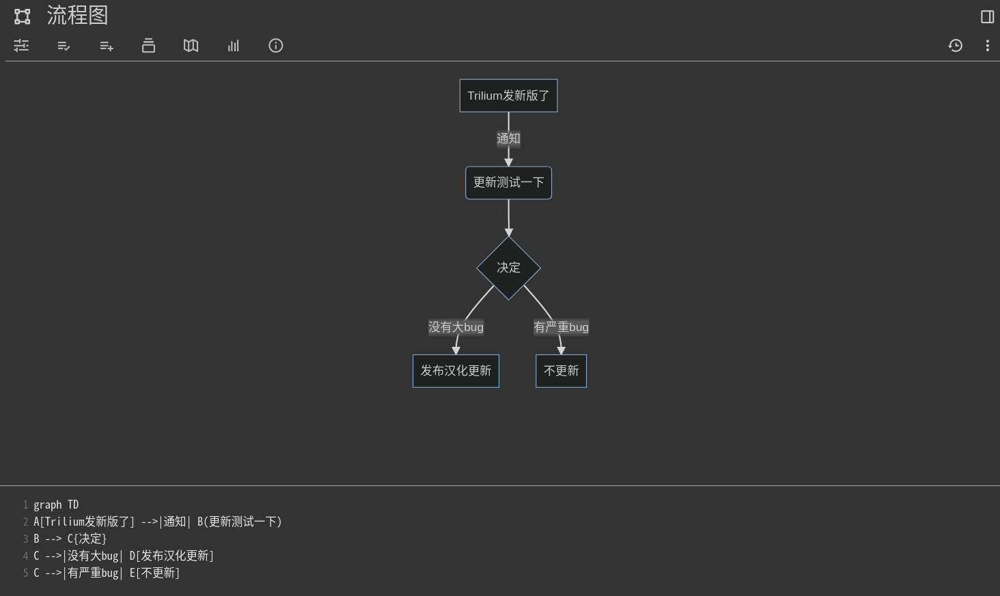

# 🌏 Trilium Translation

[](https://GitHub.com/nriver/trilium-translation/releases/)
[](https://github.com/nriver/trilium-translation/blob/master/LICENSE)
[](https://GitHub.com/nriver/trilium-translation/graphs/commit-activity)
[](https://github.com/nriver/trilium-translation/releases/)
[](https://hub.docker.com/repository/docker/nriver/trilium-cn/general)

<p align="center">
<a href="README.md">English</a> | 简体中文
</p>

我把这个牛逼的笔记软件[Trilium Notes](https://github.com/zadam/trilium)做了中文翻译. 翻译会持续跟进Trilium Notes的稳定版.

如果你想把Trilium翻译成其它语言，可以参考[这里](https://github.com/Nriver/trilium-translation/blob/main/README_CN.md#%E5%A4%AA%E9%95%BF-%E5%88%AB%E7%9C%8B-%E8%87%AA%E5%B7%B1%E7%BC%96%E8%AF%91)

如果你觉得不错, 可以留下一个star, 谢谢 ^_^

如果你是老用户, 使用前最好备份数据以防万一.

qq群满了请优先加TG群

Trilium Notes 学习交流 TG群 https://t.me/trilium_cn


Trilium Notes 交流qq群

1群 686232370 (已满)

<!--  -->

2群 535368955


# 🔔 声明

Trilium Notes 汉化版目前只通过以下渠道发布:

Trilium Notes 汉化版 Github代码仓库 https://github.com/Nriver/trilium-translation

Trilium Notes 汉化版 Docker镜像 https://hub.docker.com/r/nriver/trilium-cn

Nriver 的 scoop 仓库 http://github.com/Nriver/Scoop-Nriver

Archlinux AUR 仓库 客户端 https://aur.archlinux.org/packages/trilium-cn-bin

Archlinux AUR 仓库 服务端 https://aur.archlinux.org/packages/trilium-server-cn-bin

# 🦮 目录导航

<!--ts-->
* [🌏 Trilium Translation](#-trilium-translation)
* [🔔 声明](#-声明)
* [🦮 目录导航](#-目录导航)
* [📝 汉化版修改记录](#-汉化版修改记录)
   * [📚 关于汉化版的内置文档](#-关于汉化版的内置文档)
* [📸 界面截图](#-界面截图)
* [📖 使用方法 - Windows, Linux, MacOS 直接使用Release打包的文件](#-使用方法---windows-linux-macos-直接使用release打包的文件)
* [🖥️ 服务端](#️-服务端)
   * [🐳 服务端 - Linux - 在Docker里运行服务端](#-服务端---linux---在docker里运行服务端)
      * [🔝 Docker服务端版本更新](#-docker服务端版本更新)
   * [服务端 - Linux - 通过AUR安装Linux服务端](#服务端---linux---通过aur安装linux服务端)
      * [关于Arm服务器运行服务端的说明](#关于arm服务器运行服务端的说明)
* [🖥️ 客户端](#️-客户端)
   * [🪟 客户端 - Windows - 通过scoop安装Windows客户端](#-客户端---windows---通过scoop安装windows客户端)
   * [🐧 客户端 - Linux - 通过AUR安装客户端](#-客户端---linux---通过aur安装客户端)
* [💻 (太长, 别看) 自己编译](#-太长-别看-自己编译)
   * [翻译原理](#翻译原理)
   * [编译环境](#编译环境)
   * [🔍 翻译过程](#-翻译过程)
   * [📝 没翻译到的文字](#-没翻译到的文字)
* [注意事项](#️-注意事项)
   * [数据同步](#数据同步)
* [🤔 常见问题](#-常见问题)
   * [你用的是什么VPS服务器跑的Trilium Notes服务端?](#你用的是什么vps服务器跑的trilium-notes服务端)
   * [有关域名的一些问题](#有关域名的一些问题)
      * [如何启用HTTPS加密？](#如何启用https加密)
      * [你的域名是从哪里购买的？](#你的域名是从哪里购买的)
      * [如何申请网站证书？](#如何申请网站证书)
   * [笔记数据库在哪?](#笔记数据库在哪)
      * [客户端数据库默认路径](#客户端数据库默认路径)
      * [服务端数据库默认路径](#服务端数据库默认路径)
   * [如何修改数据库位置？](#如何修改数据库位置)
   * [如何备份数据库?](#如何备份数据库)
   * [Trilium有开放接口调用吗？](#trilium有开放接口调用吗)
   * [配置反向代理之后部分功能不正常了?](#配置反向代理之后部分功能不正常了)
   * [为什么使用了中文版的程序，界面还是英文的?](#为什么使用了中文版的程序界面还是英文的)
   * [为什么用中文版的自带文档还是英文的?](#为什么用中文版的自带文档还是英文的)
   * [为什么程序打不开?](#为什么程序打不开)
   * [为什么程序打开之后是空白一片?](#为什么程序打开之后是空白一片)
   * [日记笔记跑到别的目录下了](#日记笔记跑到别的目录下了)
   * [为什么我的docker镜像更新之后还是旧版的?](#为什么我的docker镜像更新之后还是旧版的)
   * [为什么trilium-portable.bat提示禁止执行?](#为什么trilium-portablebat提示禁止执行)
   * [提示 error 401 Unauthorized 是什么问题？](#提示-error-401-unauthorized-是什么问题)
   * [画布笔记变成了一个json文件怎么办?](#画布笔记变成了一个json文件怎么办)
      * [方法1](#方法1)
      * [方法2](#方法2)
   * [画布笔记上的文字没了怎么办？](#画布笔记上的文字没了怎么办)
   * [导入文档结果标题显示乱码怎么办？](#导入文档结果标题显示乱码怎么办)
   * [Docker运行不起来怎么办？](#docker运行不起来怎么办)
* [🚚 迁移笔记](#-迁移笔记)
   * [从 印象笔记 迁移到 Trilium](#从-印象笔记-迁移到-trilium)
   * [从 VNote或其它Markdown文件笔记 迁移到 Trilium](#从-vnote或其它markdown文件笔记-迁移到-trilium)
* [0.47 升级到 0.48 的一些问题](#047-升级到-048-的一些问题)
   * [前端js报错](#前端js报错)
   * [第三方主题不生效](#第三方主题不生效)
   * [初始化慢，同步数据慢](#初始化慢同步数据慢)
* [0.57.5 升级到 0.58.2-beta 之后版本的问题](#0575-升级到-0582-beta-之后版本的问题)
   * [自定义按钮问题](#自定义按钮问题)
* [0.58 升级到 0.59 之后版本的问题](#058-升级到-059-之后版本的问题)
   * [字数统计组件报错](#字数统计组件报错)
* [0.60 升级到 0.61 的问题](#060-升级到-061-的问题)
* [🔤 关于本项目使用的字体](#-关于本项目使用的字体)
* [🛑 限制](#-限制)
* [⏳ Stargazers 数据](#-stargazers-数据)
* [💰 捐赠](#-捐赠)
* [🙏 感谢](#-感谢)
<!--te-->

# 📝 汉化版修改记录

列举一些汉化版修改的地方

1. 界面文字修改成中文
2. 附带的示例笔记汉化, 并加入了大量实用内容, 具体请看[这里](#关于汉化版的内置文档)
3. 优化部分界面的中文显示问题
4. 替换画布笔记的excalidraw内置字体为中文手写字体, 具体请看[这里](#关于本项目使用的字体)
5. 修改ckeditor的代码, 可以使用中文的 `···` 来触发代码块

## 📚 关于汉化版的内置文档

汉化版和原版数据是互通的. 如果之前使用过原版, 示例笔记可能是英文的,
想要中文版的示例笔记可以导入 [demo.zip](https://github.com/Nriver/trilium-translation/blob/main/demo-cn.zip) 文件.

内置的文档有做汉化，不过我做了些修改，删掉了一些我认为用处不大的内容。比如Trilium自带有TODO，所以我把不太好用的任务管理删了。另外增加了一些实用的示例，比如自定义api接口等。

原版的示例没有仔细分类，有些内容又在英文wiki上，我第一次看觉得一头雾水。所以我修改了示例文档的笔记结构，给不同功能的笔记进行分类。

里面的内容完全按照我个人口味添加，你可以随意修改。但是请注意！千万不要随意修改`日记`
笔记的结构和笔记属性，你想移动可以移走整个日记笔记。不要动里面的结构，不然这个功能很容易被玩坏，所以除非你知道你在做什么，别去动这个笔记的结构！

# 📸 界面截图

原版的黑暗主题


原版的明亮主题


我做的Nier主题 :)


Excalidraw 画布笔记


Mermaid.js 流程图



数学公式


# 📖 使用方法 - Windows, Linux, MacOS 直接使用Release打包的文件

1. [Release](https://github.com/Nriver/trilium-translation/releases)里下载对应客户端
2. 解压运行(Linux桌面运行trilium, Linux服务端运行trilium.sh, Windows 运行trilium.exe, macOS 运行trilium.app).
3. 玩去吧 :)

注1: Trilium的服务端可以直接通过浏览器访问单独使用。同时也可以作为同步服务器和桌面客户端进行数据同步。
注2: Trilium更新需要同时更新服务端与客户端, 版本必须一致. 更新前以防万一请备份好数据.

---

# 🖥️ 服务端

除了直接下载Github的Release文件, 还可以通过以下方式安装服务端

## 🐳 服务端 - Linux - 在Docker里运行服务端

Trilium Notes的服务端可以用我构建好的docker镜像运行.

注意事项：

1. 请不要使用加速镜像，可以避免类似 #16, #14 下到旧版导致无法启动的问题.
2. 如果无法拉取docker镜像，可以参考 [docker官方文档](https://docs.docker.com/config/daemon/systemd/) 对 `http-proxy.conf`
   设置代理。
3. 如果 `docker compose` 无法执行，可能是docker版本比较低。你可以尝试升级docker版本或者安装`docker-compose`
   来代替`docker compose`。

运行步骤：

直接下载 [docker-compose.yml](https://raw.githubusercontent.com/Nriver/trilium-translation/main/docker-compose.yml)

```
wget https://raw.githubusercontent.com/Nriver/trilium-translation/main/docker-compose.yml
```

运行

```
docker compose up -d
```

它会从[Docker Hub](https://hub.docker.com/repository/docker/nriver/trilium-cn)直接拉镜像运行.

浏览器打开 http://127.0.0.1:8080 访问服务端.

笔记数据会在 docker-compose.yml 同目录下

(docker镜像存了一个0.47.5的旧版本备份，需要的可以自己拿)

### 🔝 Docker服务端版本更新

cd到docker-compose.yml所在目录

先停止trilium

```
docker compose down
```

拉取最新镜像

```
docker compose pull
```

运行

```
docker compose up -d
```

## 服务端 - Linux - 通过AUR安装Linux服务端

安装

```
yay -S trilium-server-cn-bin
```

直接运行 (可以使用pm2等应用管理来启动)

```
trilium-server-cn
```

同时提供了一个 `trilium-server-cn` 的服务，也可以通过 `systemctl` 来管理

```
systemctl start trilium-server-cn
```

### 关于Arm服务器运行服务端的说明

~~如果需要在Arm服务器上跑, 可以直接用trilium原版的docker镜像. 汉化版和原版数据是互通的. 可以用汉化版的客户端和原版的服务端进行链接.~~

~~汉化版暂时不会有Arm镜像. [相关issue](https://github.com/Nriver/trilium-translation/issues/10)~~

汉化版已经有Arm版的docker镜像了，可以放心食用。如果无法运行，请尝试升级docker版本。


# 🖥️ 客户端

除了直接下载Github的Release文件, 还可以通过以下方式安装客户端

## 🪟 客户端 - Windows - 通过scoop安装Windows客户端

除了手动在Github下载Release包, 现在Windows客户端可以通过scoop来安装啦!

添加我的scoop源

```
scoop bucket add Scoop-Nriver https://github.com/nriver/Scoop-Nriver
```

安装 Trilium

```
scoop install trilium-cn
```

通过scoop安装后, 在开始菜单的`Scoop Apps`下会有启动的快捷方式. 同时也可以在命令行里通过`trilium`命令启动,
这种方式启动可以方便查看报错信息.

更新 Trilium

```
scoop update trilium-cn
```

## 🐧 客户端 - Linux - 通过AUR安装客户端

Linux桌面系统可以使用AUR安装中文版客户端

```
yay -S trilium-cn-bin
```

更新

```
yay -Syu
```

# 💻 (太长, 别看) 自己编译

如果你想自己检查代码(代码都有中英双语注释)再自己编译, 可以看看下面的东西.

警告! 代码里有'rm -rf'相关命令, 胡乱修改代码可能会删除你的文件, 请小心使用.

## 翻译原理

从Trilium Notes官方的Release下载Linux包和源码, 用正则替换掉里面的界面文字再编译打包回去.

## 编译环境

我用Manjaro(Linux), 你想改成其它环境只要修改一下代码理论上也没问题.

Python3 和以下模块

```
pip3 install requests --user
```

Nodejs 和以下模块

```
npm install -g asar webpack webpack-cli
npm install webpack --save-dev
```

7z命令用来打包

## 🔍 翻译过程

1. 根据注释修改 `settings.py` 里的配置.
2. 翻译 `translations.py`. (参照 `translations_cn.py`. 大概有一千多行要翻译, 耐心点 :) )
3. 运行 `python3 init.py` 来下载最新的 Trilium Notes.
4. 运行 `python3 trans.py` 来生成翻译补丁.
4. 运行 `python3 make_release.py` 来发布翻译后的程序.

注意: `translations.py` 有一些开头和结尾引号是用来做正则匹配的, 翻译的时候别删了. 有些类似 '${xxxx}' 的字符串是 Trilium
Notes 的占位符, 别动它们.

## 📝 没翻译到的文字

参考 `trans.py` 写的, 用双花括号 '{{}}' 把要翻译的文字括起来.

把双括号里面的东西放到 `translations.py` 来做翻译. (要避免有些用花括号`}`结尾的文字, 可以把类似 `${xxx}}}'`
的改成`${xxx}'}}` )

---

# ⚠️ 注意事项

使用Trilium Notes需要注意的一些事项

## 数据同步

不能使用第三方同步工具, 比如 OneDrive 等网盘服务, 你辛苦整理的笔记数据库会被这些工具弄坏的. 如果要在多台电脑上同步Trilium
Note的笔记数据, 需要自行建立 Trilium Notes 服务端, 让 Trilium
来处理同步, 这是目前唯一受支持的同步方式.

---

# 🤔 常见问题

下面是一些我觉得有代表性的问题，群友反复问，我总结一下吧。

## 你用的是什么VPS服务器跑的Trilium Notes服务端?

~~之前用的是搬瓦工，就是太贵, 用不起了。群友之前问我推荐我都不敢说，哈哈哈哈~~

目前用的是Racknerd, 相对来说很便宜，搞活动的时候能有很多优惠。我现在用的是双十一的优惠机器，用来做Trilium的服务器绰绰有余。

Racknerd的促销似乎都是长期有效的活动，一直都可以买，有需要的话可以试试。链接带有aff，不喜欢的可以去掉。

我测试过Trilium的服务端程序大概会占150MB左右的内存。买最便宜的就够用了，一年不到100块。如果觉得硬盘不够大，可以买贵一档的，也就100出头。再贵就没有必要了。

| 促销活动         | 内存    | CPU | SSD | 流量     | 价格       | 购买                                                     |
|--------------|-------|-----|-----|--------|----------|--------------------------------------------------------|
| 2024龙舟节促销    | 1.25G | 1核  | 20G | 2T/月   | $12.88/年 | [链接](https://my.racknerd.com/aff.php?aff=6217&pid=850) |
| 2024龙舟节促销     | 2G    | 2核  | 30G | 4T/月   | $19.88/年 | [链接](https://my.racknerd.com/aff.php?aff=6217&pid=851) |
| 2024中国新年     | 1G    | 1核  | 15G | 2T/月   | $10.99/年 | [链接](https://my.racknerd.com/aff.php?aff=6217&pid=838) |
| 2024中国新年     | 1.5G  | 1核  | 25G | 4T/月   | $16.88/年 | [链接](https://my.racknerd.com/aff.php?aff=6217&pid=839) |
| 2024新年       | 768M  | 1核  | 21G | 1T/月   | $11.49/年 | [链接](https://my.racknerd.com/aff.php?aff=6217&pid=826) |
| 2024新年       | 2G    | 1核  | 35G | 2.5T/月 | $17.38/年 | [链接](https://my.racknerd.com/aff.php?aff=6217&pid=827) |
| 2023黑五       | 768M  | 1核  | 15G | 1T/月   | $10.18/年 | [链接](https://my.racknerd.com/aff.php?aff=6217&pid=792) |
| 2023黑五       | 2G    | 1核  | 30G | 2.5T/月 | $16.98/年 | [链接](https://my.racknerd.com/aff.php?aff=6217&pid=793) |
| (过期) 2023双十一 | 1G    | 1核  | 12G | 2T/月   | $11/年    | [链接](https://my.racknerd.com/aff.php?aff=6217&pid=788) |
| (过期) 2023双十一 | 2G    | 1核  | 20G | 4T/月   | $17.55/年 | [链接](https://my.racknerd.com/aff.php?aff=6217&pid=789) |
| (过期) 2023独立日 | 1G    | 1核  | 14G | 2T/月   | $11.38/年 | [链接](https://my.racknerd.com/aff.php?aff=6217&pid=775) |
| (过期) 2023独立日 | 2G    | 1核  | 20G | 3T/月   | $19.89/年 | [链接](https://my.racknerd.com/aff.php?aff=6217&pid=776) |
| (过期) 2023复活节 | 840M  | 1核  | 10G | 1T/月   | $10.78/年 | [链接](https://my.racknerd.com/aff.php?aff=6217&pid=766) |
| (过期) 2023复活节 | 1.2G  | 1核  | 30G | 3T/月   | $14.98/年 | [链接](https://my.racknerd.com/aff.php?aff=6217&pid=767) |
| (过期) 2022黑五  | 768M  | 1核  | 10G | 1T/月   | $10.28/年 | [链接](https://my.racknerd.com/aff.php?aff=6217&pid=695) |
| (过期) 2022黑五  | 1.5G  | 1核  | 30G | 3T/月   | $16.88/年 | [链接](https://my.racknerd.com/aff.php?aff=6217&pid=696) |

你也可以选择其它的VPS提供商，不过要记得备份数据，数据是无价的。做好备份以防万一，切记。

## 有关域名的一些问题

### 如何启用HTTPS加密？

一般来说，通过端口访问的HTTP请求是明文的。如果需要使用HTTPS加密，需要与域名配合使用。

### 你的域名是从哪里购买的？

我的域名是在Namesilo购买的，价格很实惠。如果你有需要，可以试试。以下是带有aff的链接，如果你不喜欢，可以去掉。此外，还有优惠券码`nriver`
，初次购买域名可节省1美元。

[域名购买链接](https://www.namesilo.com/?rid=d62cb16lq)

### 如何申请网站证书？

对于网站证书，你可以使用免费的`acme.sh`
工具。具体操作可以查看[acme.sh申请证书的文档](https://github.com/acmesh-official/acme.sh/wiki/%E8%AF%B4%E6%98%8E)。

## 笔记数据库在哪?

### 客户端数据库默认路径

win C:\Users\用户名\AppData\Roaming\trilium-data

linux /home/用户名/.local/share/trilium-data

mac /Users/用户名/Library/ApplicationSupport/trilium-data

### 服务端数据库默认路径

linux-server 在 /home/用户名/trilium-data

docker 在docker-compose.yml同目录的`trilium-data`文件夹里

## 如何修改数据库位置？

可以参考客户端自带的`trilium-portable.sh`或者`trilium-portable.bat`以绿色版的方式运行。改数据库位置只要修改文件里的数据库路径即可。

如果你想体验原版最新的特性，建议使用这种方式运行。

## 如何备份数据库?

Trilium有自动备份功能，软件内可以左上角设置里可以设定自动备份频率。如果需要手动备份，请务必先停止Trilium，然后找到对应的trilium-data目录进行备份。

注意，服务端和客户端的数据库文件是不能互相替换的，我之前尝试过，替换之后无法启动。但是客户端之间的数据库是可以直接复制粘贴的，比如可以把linux桌面客户端的数据直接拷贝给windows桌面客户端。

## Trilium有开放接口调用吗？

有的，Trilium有叫做ETAPI的接口可供调用。我把接口用python进行了封装，有兴趣的可以移步到我的另一个项目[Trilium-py](https://github.com/Nriver/trilium-py)
查看。

## 配置反向代理之后部分功能不正常了?

直接用ip访问服务正常，用了反向代理之后一些功能用不了了，应该是反向代理的websocket配置的不对。请参考[官方反向代理的说明](https://github.com/zadam/trilium/wiki/Server-installation)
进行配置。

## 为什么使用了中文版的程序，界面还是英文的?

你运行过原版的Trilium程序，系统里有英文版的缓存，请关闭trilium，
Windows系统删除这个目录`C:\Users\用户名\AppData\Roaming\Trilium Notes`, Linux系统删除这个目录`~/.config/Trilium Notes/`
。再启动Trilium就是中文的了。

## 为什么用中文版的自带文档还是英文的?

你运行过原版的Trilium程序,
你的笔记数据库已经按照英文的文档初始化过了。想要中文文档可以直接把项目中的demo-cn.zip导入到笔记中，或者删掉旧数据库(
数据自行备份)，用中文版启动，重新进行初始化。

## 为什么程序打不开?

低版本的Trilium无法打开高版本的Trilium创建的数据，会导致程序无法启动。我发布中文版程序不会跟着原版每个版本都更新，版本号肯定是滞后的。

## 为什么程序打开之后是空白一片?

可能是GPU驱动不兼容，请尝试关闭gpu加速。增加启动运行参数，使用 `trilium --disable-gpu` 来启动。

## 日记笔记跑到别的目录下了

如果你创建日记笔记的时候笔记跑到别的地方去了，可以在`日记`这个笔记里加一个 `#calendarRoot`
的属性，再把错位的日记手动移到正常的笔记位置就行。如果还是不行，请手动搜索有没有其它笔记有 `#calendarRoot`
，如果有就请删掉。

## 为什么我的docker镜像更新之后还是旧版的?

目前我也不太清楚正确的解决办法, 只能有这几点建议:

1. 不用国内的加速镜像, 它们的数据有可能不是最新的. 去掉加速镜像后再尝试从官方源拉取镜像.
2. 将本地的旧版镜像完全删除，然后再尝试拉取镜像.
3. (危险操作, 注意) 停掉trilium, 使用 `docker system prune -a` 来清理掉所有没有在使用的docker镜像和容器等再重新pull.

## 为什么`trilium-portable.bat`提示禁止执行?

0.50之后的windows客户端的portable模式改成了用powershell运行, 部分电脑上可能默认不允许运行`.ps1`格式的文件.
可以尝试在命令行输入以下命令解除限制. 请一行一行地执行.

```
powershell
set-executionpolicy remotesigned
```

## 提示 `error 401 Unauthorized` 是什么问题？

一种可能是服务端和客户端的版本不一致，请使用相同版本的Trilium来避免出现各种问题。
还可能是服务端或客户端的系统时间不对导致的，请修改一下系统时间，保持两边时间一样就行。

## 画布笔记变成了一个json文件怎么办?

### 方法1

把json文件导出来，新建一个画布笔记，再从画布里把json导入。

### 方法2

在新版的Trilium里创建的画布笔记, 如果不小心在另一个旧的客户端进行同步, 会因为无法识别这种类型的笔记, 会自动把它的笔记类型改成文件来处理.
解决办法: 先把服务端和所有的客户端都升级到最新版.
在笔记信息里找到对应笔记的ID, 然后在左上菜单里打开SQL控制台. 里面输入以下sql, 注意修改笔记ID.

```
update notes set `type` = 'canvas' where noteId = '你的笔记ID'
```

点击下方的运行. 然后关闭客户端, 重启服务端, 画布笔记就回来了.

## 画布笔记上的文字没了怎么办？

版本升级之后, 画布笔记上的文字看不到了。可以参考这个 https://github.com/zadam/trilium/issues/3979#issuecomment-1798395522

把笔记导出, 找到.json文件, 用在线版本的 https://excalidraw.com/ 打开那个json文件, 应该能看到文字。之后把它导出,
再把导出的.excalidraw改成.json导入回trilium就行.

## 导入文档结果标题显示乱码怎么办？

这个问题一般出现在中文Windows系统上, Windows系统默认使用GBK编码, 而Trilium需要UTF-8编码. 一个简单的解决办法是使用Bandizip,
设置使用UTF-8文件名对文件进行压缩,
这样就能被Trilium正常识别.

设置可以参考[Bandizip的官方文档](https://cn.bandisoft.com/bandizip/help/utf8/). 在Bandizip的 `选项-设置-压缩设置`
里勾上 `在Zip文件中使用Unicode文件名(UTF-8)`的选项即可.

[这里](docs/中文测试.zip)有个UTF-8格式的压缩包例子, 你可以导入试试, 中文文件名可以正常显示.

## Docker运行不起来怎么办？

请尝试更新docker和docker-compose工具的版本, 下面是我使用的工具版本

```
❯ docker -v
Docker version 23.0.4, build f480fb1e37
❯ docker-compose -v
Docker Compose version 2.17.3
```

如果你的docker版本太旧，有可能会无法启动。

如果docker用不了，请尝试直接从release下载服务器版的zip包运行。

还是不行的话，建议换一个新一点的Linux发行版，软件环境太旧也可能无法运行。

新版本的docker已内置docker-compose，可以用 `docker compose` 代替 `docker-compose` 命令。

---

# 🚚 迁移笔记

## 从 印象笔记 迁移到 Trilium

新版的印象笔记无法直接导出`.enex`格式的文件, 需要借助 https://github.com/vzhd1701/evernote-backup 工具进行导出.
导出后的`.enex`文件可以导入进Trilium. 只需要在Trilium左侧笔记树点击右键`导入`, 选择`.enex`文件即可导入.
你可以去掉`压缩图片`的选项来保证图片清晰度.

## 从 VNote或其它Markdown文件笔记 迁移到 Trilium

[VNote](https://github.com/vnotex/vnote)是一个体验很棒的Markdown笔记软件, 我在用Trilium之前已经使用了很多年的VNote,
如果你是Markdown爱好者, 请尝试一下VNote.

言归正传, Trilium官方导入markdown的功能有一些瑕疵, 比如有无法导入图片等问题.
需要导入Markdown笔记可以通过我写的[Trilium-py](https://github.com/Nriver/trilium-py)进行导入. 目前我已经把我所有的VNote笔记迁移过来了,
暂时没有发现问题. 如果你有发现什么不兼容的情况, 欢迎到[Trilium-py](https://github.com/Nriver/trilium-py)提issue.

---

# 0.47 升级到 0.48 的一些问题

首先要说，追求稳定的话，不建议升级，因为改动很大，潜在问题比较多。

## 前端js报错

原版程序变化很大，有一些api改变了，如果是从旧版本升级上来的，js代码有些不兼容。

大部分js问题加个 async 就能解决

比如

```
const notes = await api.runOnBackend(() => {
```

改成

```
const notes = await api.runOnBackend(async () => {
```

## 第三方主题不生效

前端变化太大，旧的第三方主题基本全部失效，先用内置的主题吧。

## 初始化慢，同步数据慢

如果是第一次启动0.48，可能会卡在初始化那个页面，等个几秒钟直接把程序关了再打开就行。

如果是0.47升级上来，同步数据可能会特别慢。尝试直接把客户端的数据库移走，重新初始化客户端数据会快一点。

---

# 0.57.5 升级到 0.58.2-beta 之后版本的问题

## 自定义按钮问题

由于功能大改, 之前使用 `api.addButtonToToolbar` 添加的js按钮都失效了, 需要把原来的js按钮注释掉或者删掉.

然后在左上角设置里找到`配置启动栏`, 右键点击已经失效的按钮选择重置来删除掉它.

需要自定义按钮功能的可以自己在`配置启动栏`里设置.

---

# 0.58 升级到 0.59 之后版本的问题

## 字数统计组件报错

由于API变化，字数统计组件的代码需要修改，请将字数统计组件的代码替换为最新的 [word count 字数统计组件.js](https://github.com/Nriver/trilium-translation/blob/main/demo-cn/示例笔记%20-%20请不要删除/Trilium%20扩展/Trilium%20组件%20widget/word%20count%20字数统计组件.js)

---

# 0.60 升级到 0.61 的问题

由于数据库结构和API变化，示例笔记中的`统计`
功能会报错，需要更新相关的js代码，请找到对应有报错的js文件替换成最新版的。代码在[这里](https://github.com/Nriver/trilium-translation/tree/main/demo-cn/示例笔记%20-%20请不要删除/Trilium%20扩展/统计)

---

# 🔤 关于本项目使用的字体

本项目使用的字体文件为免费字体.

`font/muyao-shouxie.ttf` 沐瑶随心手写体来自 [这里](https://www.maoken.com/freefonts/1323.html)
`font/muyao-softbrush.ttf` 沐瑶软笔手写体 [这里](https://www.maoken.com/freefonts/1309.html)

感谢 [春颜秋色](https://www.zcool.com.cn/u/402511) 发布的这两款免费字体！

---

# 🛑 限制

Trilium Notes的文字是硬编码的, 所以没法切换语言.
翻译是修改代码, 如果把代码改坏了, 你的数据有可能丢失, 所以做好备份.

如果真改坏了, Trilium Notes启动不了, 或者翻译错了, 就要用`init.py`重新下载Trilium Notes.

---

# ⏳ Stargazers 数据

统计图使用 [caarlos0/starcharts](https://github.com/caarlos0/starcharts) 项目生成.

[](https://starchart.cc/Nriver/trilium-translation)

---

# 💰 捐赠

如果你觉得我做的翻译对你有帮助, 欢迎捐赠, 这对我来说是莫大的鼓励!

支付宝:  


微信:  


Ko-fi:  
[](https://ko-fi.com/nriver)

---

# 🙏 感谢

你们的支持, 让我充满了决心.

感谢 `t**e` 赞助的20元!

感谢 `1*0` 赞助的8元! 备注: 蜜雪冰城

感谢 `**钧` 赞助的38元! 备注: 咖啡

感谢 `*风` 赞助的25元!

感谢 `**进` 赞助的25元!

感谢 `*军` 赞助的18元! 备注: 七分甜

感谢 `**逸` 赞助的10元!

感谢 `**恩` 赞助的30元!

感谢 `**莲` 赞助的10元!

感谢 `**楷` 赞助的5元!

感谢 `J*s` 赞助的50元!

感谢 `*记` 赞助的10元! 备注: 多谢大佬的辛勤付出

感谢 `*睿` 赞助的5元! 备注: 感谢您的自动命名工具

感谢 `*建` 赞助的200元! 备注: trilium

感谢 `*称` 赞助的10元!

感谢 `**逸` 赞助的10元! 备注: 大佬牛逼

感谢 `*斌` 赞助的10元!

感谢 `*僧` 赞助的30元! 备注: 加油，老哥！

感谢 `*天` 赞助的9元!

感谢 `*均` 赞助的30元! 备注: 翻译辛苦了，喝杯咖啡

感谢 `A*s` 赞助的30元!

感谢 `**逸` 赞助的20元!

感谢 `*臾` 赞助的30元!

感谢 `*冰` 赞助的10元!

感谢 `*遥` 赞助的10元! 备注: 感谢群主的翻译

感谢 `**庆` 赞助的10元!

感谢 `**逸` 赞助的50元!

感谢 `**聪` 赞助的10元! 备注: 很大的帮助翻译家！爱来自中国

感谢 `*メ` 赞助的200元!

感谢 `**奇` 赞助的20元!

感谢 `*磊` 赞助的10元!

感谢 `*姆` 赞助的5元!

感谢 `**锐` 赞助的20元! 备注: 感谢您的工作，请您喝杯咖啡

感谢 `**行` 赞助的10元! 备注: 小葱白贡献绵薄之力

感谢 `鞠*M` 赞助的10元! 备注: 感谢大佬，请喝水

感谢 `*🐈` 赞助的10元!

感谢 `*白` 赞助的10元! 备注: 小葱白献上

感谢 `*白` 赞助的5元! 备注: 小葱白献上

感谢 `*杜` 赞助的20元! 备注: 谢谢您的翻译

感谢 `*伟` 赞助的20元!

感谢 `*淼` 赞助的10元! 备注: 今天第一天下载使用，感觉发现新大陆，谢谢！（希望入群交流）

感谢 `*落` 赞助的10元! 备注: 感谢长期的坚持♥

感谢 `*F` 赞助的99元! 备注: 感谢分享 希望深度合作 长期学习交流

感谢 `*F` 赞助的200元! 备注: Best wishes

感谢 `F*g` 赞助的10元!

感谢 `**逸` 赞助的30元! 备注: 来杯奶茶，哈皮一下

感谢 `*绿` 赞助的20元! 备注: 多谢,学生能力有限，尽一份心意

感谢 `A*` 赞助的100元! 备注: 非常感謝你寫這個小程式，捐贈了小小的心意給你及保重身體!

感谢 `*户` 赞助的20元!

感谢 `*孤` 赞助的20元! 备注: 请群主大大喝杯奶茶

感谢 `X*H` 赞助的10元!

感谢 `**辉` 赞助的20元! 备注: 感谢大佬，辛苦了

感谢 `*卫` 赞助的50元! 备注: 希望能保持更新

感谢 `**鄂` 赞助的10元!

感谢 `**幻` 赞助的10元!

感谢 `C*W` 赞助的50元!

感谢 `*超` 赞助的10元!

感谢 `*磊` 赞助的30元!

感谢 `**龙` 赞助的200元!

感谢 `*平` 赞助的20元!

感谢 `*燃` 赞助的66元!

感谢 `**喜` 赞助的10元!

感谢Jetbrins公司提供的Pycharm编辑器!

[](https://jb.gg/OpenSource)
